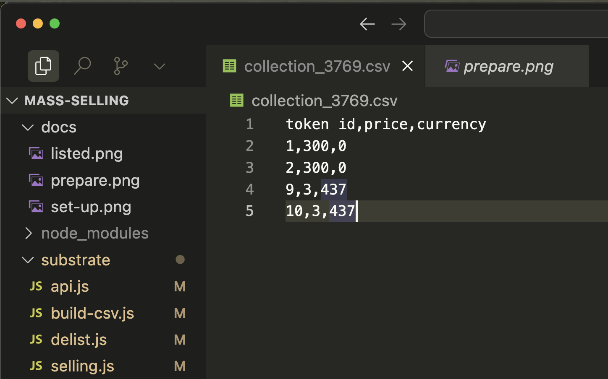

# Mass NFT listing on Unique Market

These scripts are for those who have already minted a large NFT collection and want to list many tokens on the [Unique Market](https://unqnft.io). They can help you put NFTs up for sale quickly without manually signing every transaction.

## ⚙️ Step-1: Setting up environment

1. You will need node.js, git, and Visual Studio Code installed on your computer. If you haven't worked with git, node, and npm before, we recommend reading our [brief guide](https://docs.unique.network/tutorials/minting/setup-environment.html) to configure your environment.
2. Download [this](https://github.com/UniqueNetwork/mass-selling/tree/master) project and open it in Visual Studio Code, click `File` - `Open Folder...`
3. Create a file named `.env` in the root directory of your project and copy the contents from the `.env.example` file into it.
4. In the .env set `SUBSTRATE_SEED` with a 12-words mnemonic secret phrase of the NFTs owner. Set `COLLECTION_ID` with the id of your collection. Remember to save the file!
5. Install dependencies. Open VS Code built-in terminal by clicking `Terminal` - `New Terminal`. In the terminal window that appears, enter the command:

```sh:no-line-numbers
npm install
```

> [!IMPORTANT]
> Keep your secrets, such as `SUBSTRATE_SEED`, safe, and do not commit them to version control! We have added .env to the .gitignore file for this purpose.

In this step, your project should resemble the screenshot below:


## 📄 Step-2: Get your NFTs list

Create a .csv file with a list of tokens that belong to you. Run in terminal:

```sh:no-line-numbers
npm run build
```

After executing the script, the `collection_123.csv` file will be created in the root of the project with the contents:

| token id | price |
|----------|-------|
| 1        | 1     |
| 2        | 1     |
| 3        | 1     |

All your tokens from the specified collection are registered in the table. All tokens have a default price of 1. Change these prices to your liking and save the file.
Prices are expected to be written without decimals, so 1 in the price cell means 1 000 000 000 000 000 000 in a contract.

Set the desired price for the tokens you want to list on Unique Market and remove all the tokens you don't want to sell.

We set tokens 1, 2, 9, and 10 for sale here. Tokens 1 and will be listed for 300 UNQ. Tokens 9 and 10 for 500 UNQ


## 🎁 Step-3: List your NFTs for sale

To put up for sale all the tokens in the created .csv file for the price specified in the file, run the script:

```sh:no-line-numbers
npm run sell
```

It will take some time, and in the end, you will see your tokens listed for sale on Unique Market.


## Delist

To remove all the tokens from the created .csv file from the sale, run the script

```sh:no-line-numbers
npm run delist
```

## 🔥 Burn NFTs

To burn tokens from your collection, follow these steps:

1. Ensure your `COLLECTION_ID` is set correctly in the `.env` file.
2. Update the `collection_717.csv` file with the token IDs you want to burn. The price column is not used for burning, so you can leave it as is.
3. Run the burn script:

```sh:no-line-numbers
npm run burn
```

This will burn all the tokens listed in the CSV file from your collection.

## 🔄 Transfer NFTs

To transfer tokens to multiple addresses, follow these steps:

1. Ensure your `COLLECTION_ID` is set correctly in the `.env` file.
2. Update the `collection_717.csv` file with the token IDs you want to transfer.
3. Create or update the `addresses.csv` file with the recipient addresses, one per line.
4. Run the transfer script:

```sh:no-line-numbers
npm run transfer
```

This will transfer the tokens listed in `collection_717.csv` to the addresses in `addresses.csv`. If there are more tokens than addresses, the script will cycle through the addresses, distributing tokens evenly.

### Transfer Script Features:
- Progress bar to show transfer status
- Detailed logging of each transfer
- Error handling and reporting
- Saves failed transfers to `error_log.csv` for review

Note: Ensure you have sufficient balance to cover the transaction fees for all transfers.

## ⚠️ Important Notes

- Always double-check your CSV files before running burn or transfer scripts to avoid unintended actions.
- Keep your `SUBSTRATE_SEED` secure and never share it.
- Make sure the amount of tokens you want to transfer is divisible by the amount of addresses you want to transfer to so they can be divided evenly.
- For large collections, consider running the scripts in smaller batches to manage gas fees and reduce the risk of timeouts.
